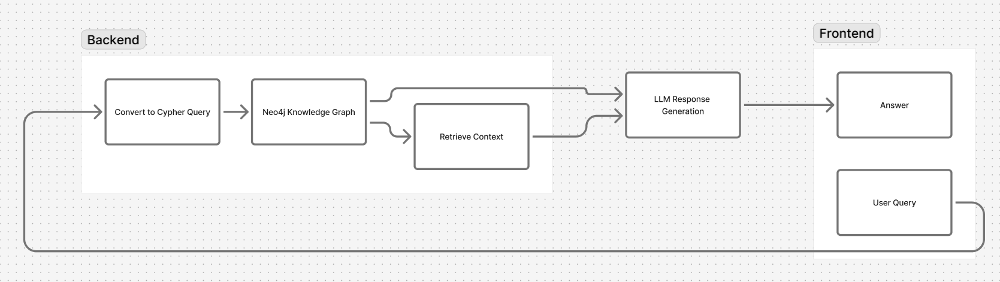

## NeoGraphAI

A practical playground for graph-augmented large language models, combining the power of Neo4j with LLMs and knowledge graphs.  
Built by Anu & Roshni’s photography-inspired coder. (Okay, me — Anul Sasidharan.)

### Project Architecture



---

### 🎯 Why this project?

In the era of generative AI, purely unstructured text or embeddings sometimes fall short of explaining *relationships*. Graph-based systems like Neo4j shine when you want to ask questions like:
- “How are these entities connected?”
- “What is the chain of dependencies?”  
- “Show me the path from Person A to Topic X through multiple hops.”

NeoGraphAI sets up a simple yet extendable pipeline:
1. Build a knowledge graph (KG) via LLM-assisted ingestion.  
2. Index/query KG with Cypher.  
3. Use retrieved context + LLM to answer open-ended questions with greater insight.

---

### 📂 What’s in the repo

- `.gitignore` — Standard ignore file.  
- `requirements.txt` — Python dependencies to spin this up.  
- `KG_Builder_Using_LLM.ipynb` — Notebook to build a knowledge graph using LLM prompts + Neo4j ingestion.  
- `GraphRAG_with_LLM_and_neo4j.ipynb` — Notebook demonstrating Retrieval-Augmented Graph (RAG) querying of the KG, combining Cypher + LLM answer generation.  
- `README.md` — This file.  
- (Future) Other modules/scripts to integrate production-grade architectures.

---

### 🚀 Getting started

### Prerequisites
- Python 3.9+ (or whichever you prefer)  
- Neo4j server (local or cloud)  
- OpenAI API key (or another LLM provider)  
- Basic knowledge of Cypher and LLM integration (which you’ve got great experience in!)

### Installation
```bash
git clone https://github.com/anulsasidharan/NeoGraphAI.git
cd NeoGraphAI
pip install -r requirements.txt
```

---
### Configuration

- Start your Neo4j instance (default bolt port etc.).

- In the notebook(s), update your connection details:

    - NEO4J_URI (e.g., bolt://localhost:7687)

    - NEO4J_USER / NEO4J_PASSWORD

    - OPENAI_API_KEY (set environment variable or directly in notebook for testing)

- Run the KG builder notebook to create graph nodes/relationships.

- Run the RAG notebook to ask queries and see how context from the graph improves LLM answers.

### 🧠 How it works (high-level)

1. Data ingestion: Feeding documents / structured sets into LLM prompts to extract entities & relations.

2. Graph modeling: Nodes + relationships are created in Neo4j; example: (Person)-[:ACTED_IN]->(Movie).

3. KG query: User question gets converted (or partly supplemented) to a Cypher query (MATCH … RETURN …).

4. Context retrieval: Use Cypher results as context (text blob) for LLM prompt.

5. Answer generation: LLM is given the retrieved context + original user query → returns a more informed answer.

### 🎯 Use-cases & future possibilities

- Ask complex relationship questions: “Who acted with Keanu Reeves in The Matrix trilogy?”

- Build domain-specific KGs (medical, legal, engineering) and layer Q&A on top.

- Extend to multi-hop reasoning, traceability, and explainable AI (graph path extraction + LLM summarization).

- Productionize via an API or Streamlit UI (hey, you wanted a Streamlit playground!).

